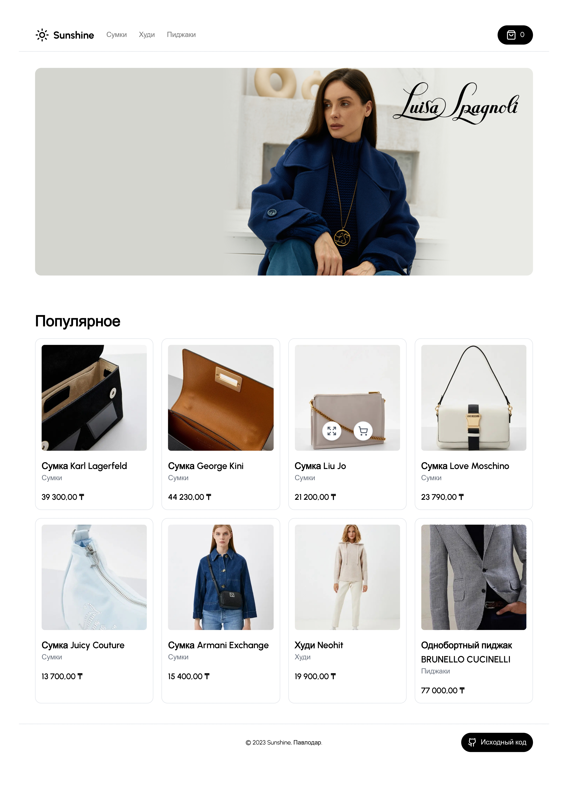
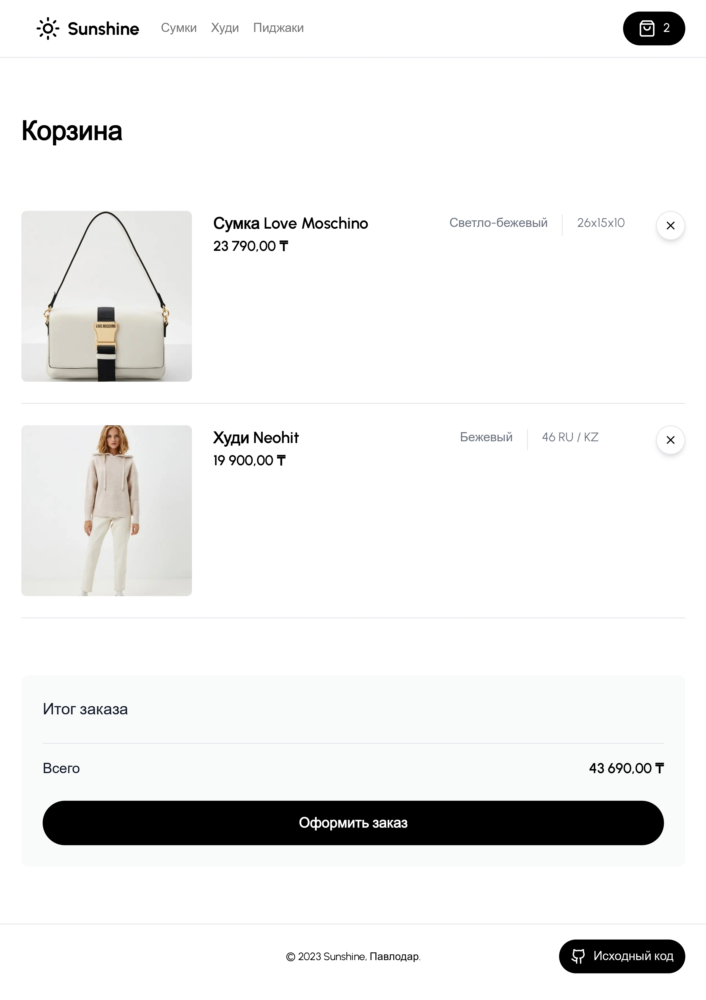

# sunshine-store-admin

## Человеко-машинное взаимодействие

### Бейсенов М.К. МИС-22н

### Лабораторная работа №4

### [Домашняя страница магазина](https://sunshine-pvl.vercel.app)

### [Домашняя страница CMS](https://sunshine-store-admin.vercel.app)

На
основе [макета](https://www.figma.com/file/S1kZ5RaPlBFcjDRqfsTQ64/%D0%A7%D0%9C%D0%92.-%D0%91%D0%B5%D0%B9%D1%81%D0%B5%D0%BD%D0%BE%D0%B2-%D0%9C.%D0%9A.-%D0%9C%D0%98%D0%A1-22%D0%BD.-%D0%9F%D1%80%D0%B0%D0%BA%D1%82%D0%B8%D1%87%D0%B5%D1%81%D0%BA%D0%B0%D1%8F-%D1%80%D0%B0%D0%B1%D0%BE%D1%82%D0%B0-%E2%84%963?type=design&node-id=0%3A1&mode=design&t=0BgHacwIUIrJthQi-1),
разработанного в задании 3 создать конечный вид интерфейса пользователя (1-3 страницы или больше).

## Домашняя страница



## Корзина



## Шаблон .env

```dotenv
NEXT_PUBLIC_CLERK_PUBLISHABLE_KEY=
CLERK_SECRET_KEY=
NEXT_PUBLIC_CLERK_SIGN_IN_URL=/sign-in
NEXT_PUBLIC_CLERK_SIGN_UP_URL=/sign-up
NEXT_PUBLIC_CLERK_AFTER_SIGN_IN_URL=/
NEXT_PUBLIC_CLERK_AFTER_SIGN_UP_URL=/

DATABASE_URL=
DATABASE_PASSWORD=

NEXT_PUBLIC_CLOUDINARY_CLOUD_NAME=
NEXT_PUBLIC_CLOUDINARY_IMAGE_UPLOAD_PRESET=
STRIPE_API_KEY=
FRONTEND_STORE_URL=
STRIPE_WEBHOOK_SECRET=
```
